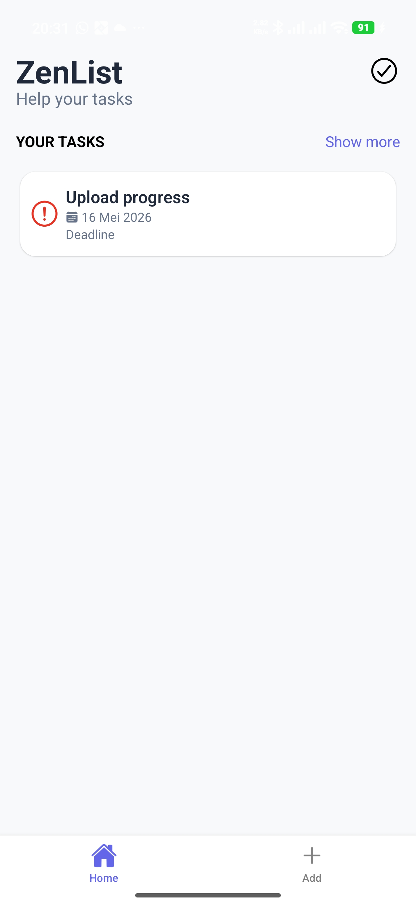
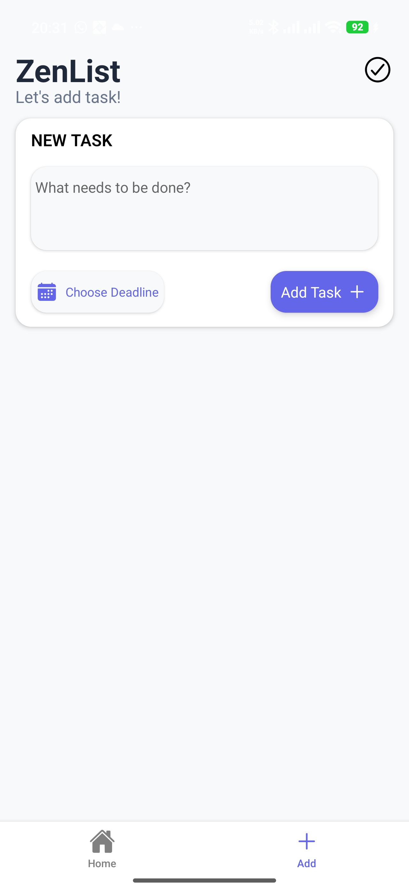
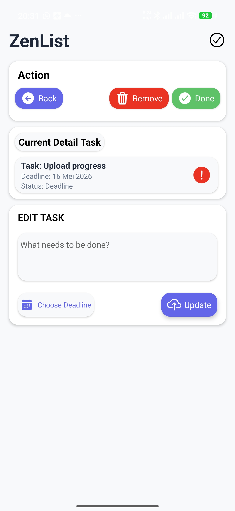
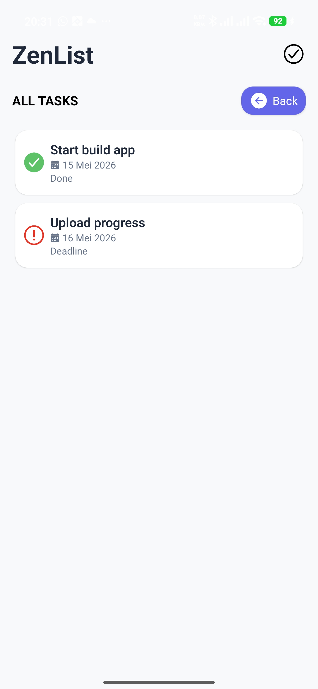

# ZenList

Aplikasi manajemen tugas (to-do list) berbasis **React Native (Expo)** yang berjalan sepenuhnya secara lokal tanpa backend. ZenList dirancang untuk membantu mencatat, melacak tenggat waktu, dan mengelola status tugas sehari-hari dengan antarmuka yang sederhana dan cepat.

---

## Daftar Isi

- [Fitur](#fitur)
- [Tech Stack](#tech-stack)
- [Screenshots](#screenshots)
- [Cara Install & Jalankan](#cara-install--jalankan)
- [Struktur Project](#struktur-project)

---

## Fitur

- **Home Screen** — Menampilkan maksimal 6 tugas yang belum selesai, dengan kategori status:
  - 🟢 **Done** — Tugas selesai
  - 🔴 **Deadline** — Tenggat hari ini atau sudah lewat
  - ⏳ **Pending** — Masih menunggu
- **Create Task** — Tambah tugas baru dengan judul (maks 35 karakter) dan deadline (minimal besok)
- **Task Detail** — Lihat detail, edit judul & deadline, toggle status Done/Undone, atau hapus tugas dengan konfirmasi
- **All Tasks** — Lihat seluruh daftar tugas tanpa filter
- **Penyimpanan Lokal** — Semua data tersimpan di perangkat menggunakan AsyncStorage
- **Navigasi Tab & Stack** — Berbasis Expo Router (file-based routing)

---

## Tech Stack

| Teknologi                                                                                               | Versi    | Kegunaan               |
| ------------------------------------------------------------------------------------------------------- | -------- | ---------------------- |
| [Expo](https://expo.dev)                                                                                | ~54.0.33 | Framework React Native |
| [React Native](https://reactnative.dev)                                                                 | 0.81.5   | Platform mobile        |
| [React](https://react.dev)                                                                              | 19.1.0   | UI library             |
| [TypeScript](https://www.typescriptlang.org)                                                            | ~5.9.2   | Type safety            |
| [Expo Router](https://docs.expo.dev/router/introduction/)                                               | ~6.0.23  | File-based routing     |
| [AsyncStorage](https://react-native-async-storage.github.io/async-storage/)                             | 2.2.0    | Penyimpanan lokal      |
| [@react-native-community/datetimepicker](https://github.com/react-native-datetimepicker/datetimepicker) | 8.4.4    | Pemilih tanggal        |
| [@expo/vector-icons](https://docs.expo.dev/guides/icons/) (Ionicons)                                    | ^15.0.3  | Ikon                   |
| [react-native-reanimated](https://docs.swmansion.com/react-native-reanimated/)                          | ~4.1.1   | Animasi                |
| [react-native-gesture-handler](https://docs.swmansion.com/react-native-gesture-handler/)                | ~2.28.0  | Gesture                |

---

## Screenshots

| Home                                   | Create Task                                    | Task Detail                                    | All Tasks                                       |
| -------------------------------------- | ---------------------------------------------- | ---------------------------------------------- | ----------------------------------------------- |
|  |  |  |  |

---

## Cara Install & Jalankan

### Prasyarat

- [Node.js](https://nodejs.org) (LTS)
- [Expo CLI](https://docs.expo.dev/get-started/installation/)
- [Android Studio](https://developer.android.com/studio) (untuk emulator Android) atau
- [Expo Go](https://expo.dev/client) di perangkat fisik

### Langkah-langkah

```bash
# 1. Clone repository
git clone https://github.com/GalangKuy/zenlist-app.git
cd zenlist-app

# 2. Install dependencies
npm install

# 3. Jalankan aplikasi
npm start
```

Setelah server Expo berjalan, scan QR code dengan **Expo Go** atau tekan:

- `a` untuk membuka di emulator Android
- `i` untuk membuka di simulator iOS
- `w` untuk membuka di web browser

### Script yang Tersedia

| Perintah          | Keterangan            |
| ----------------- | --------------------- |
| `npm start`       | Mulai dev server Expo |
| `npm run android` | Jalankan di Android   |
| `npm run ios`     | Jalankan di iOS       |
| `npm run web`     | Jalankan di web       |
| `npm run lint`    | Linting (ESLint)      |

---

## Struktur Project

```
zenlist-app/
├── app/                          # Expo Router (file-based routing)
│   ├── _layout.tsx               # Root layout (Stack navigator)
│   ├── (tabs)/                   # Tab navigator
│   │   ├── _layout.tsx           # Konfigurasi tab (Home + Add)
│   │   ├── index.tsx             # Home screen
│   │   └── create.tsx            # Create task screen
│   └── task/
│       ├── [id].tsx              # Task detail / edit / delete
│       └── allTasks.tsx          # All tasks list
├── assets/
│   ├── icons/                    # Ikon aplikasi (iOS, Android, splash)
│   ├── images/                   # Gambar pendukung
│   └── documentation/            # Screenshot untuk dokumentasi
├── components/
│   └── Header.tsx                # Komponen header bersama
├── utils/
│   └── color.ts                  # Tema warna aplikasi
├── app.json                      # Konfigurasi Expo
├── eas.json                      # Konfigurasi EAS Build
├── tsconfig.json                 # Konfigurasi TypeScript
└── package.json                  # Dependencies & scripts
```
